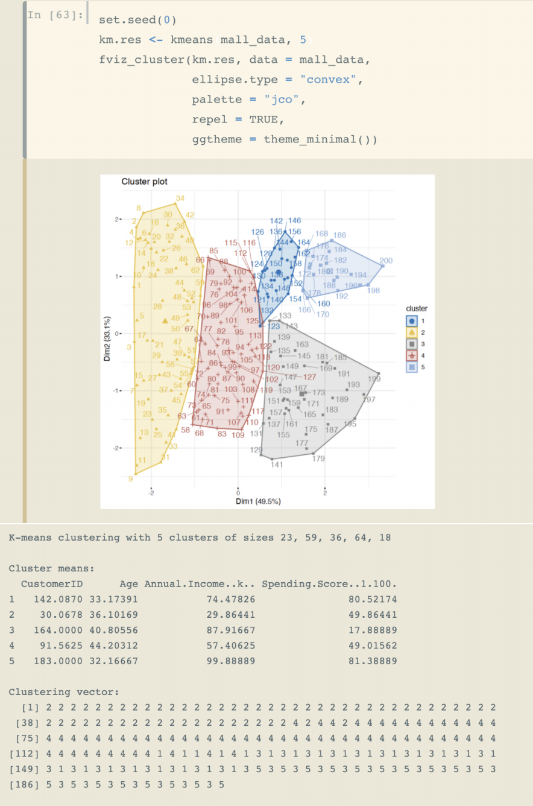
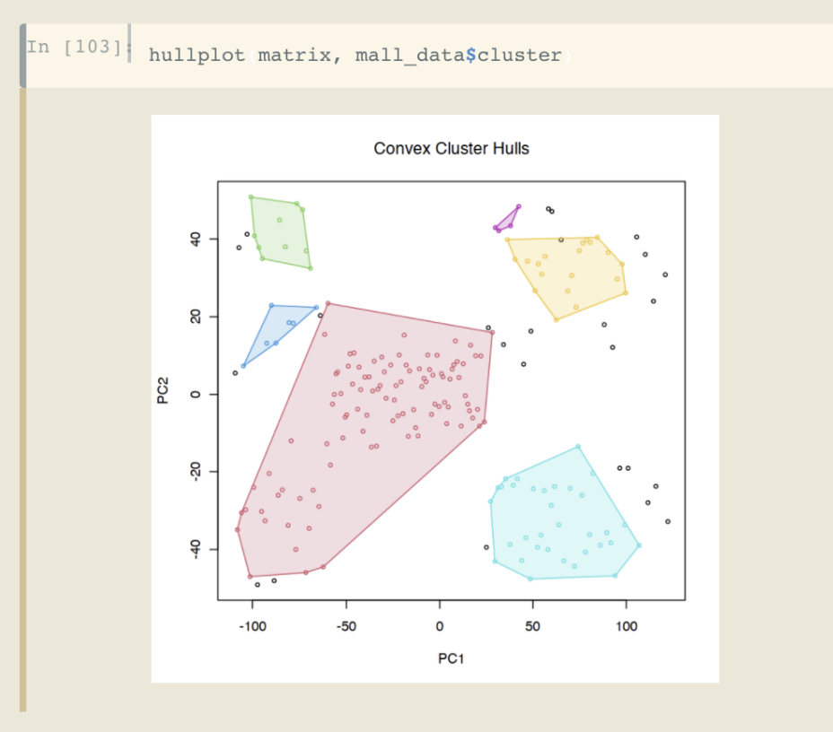
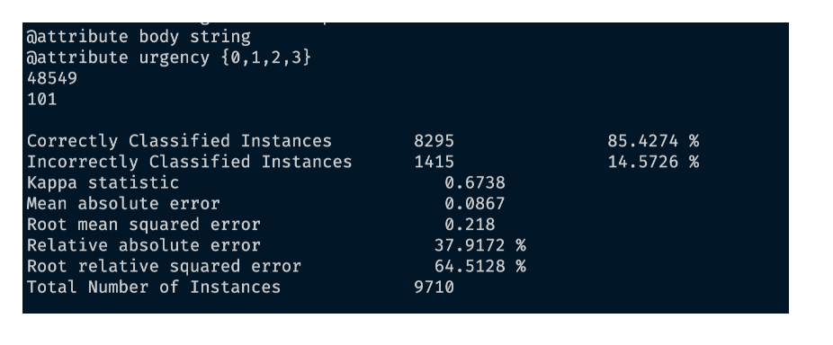
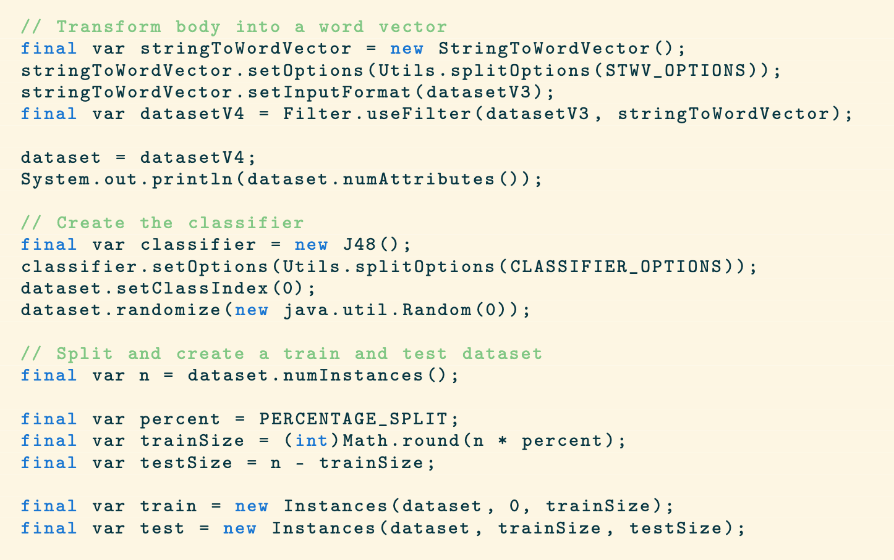

# LearningMachineLearning

Documents and codes I created while learning about machine learning (except NN as I have a repo for them)

## Clusters and Consumers

A general analysis of consumer data using cluster analysis (k means and DBSCAN) to propose consumer groups.

[Show me the code](https://soyoscarrh.github.io/LearningMachineLearning/Cluster/ClustersAndConsumers.html)

## Document classification using Decision Tree

The problem chosen was to predict the urgency of a message given in its content,
being more specific try to classify the urgency of a "support ticket".

To solve it I used a decision tree using Weka's Java API.

[Show me the code](https://soyoscarrh.github.io/LearningMachineLearning/DocumentDecisionTree/Document/doc.pdf)

